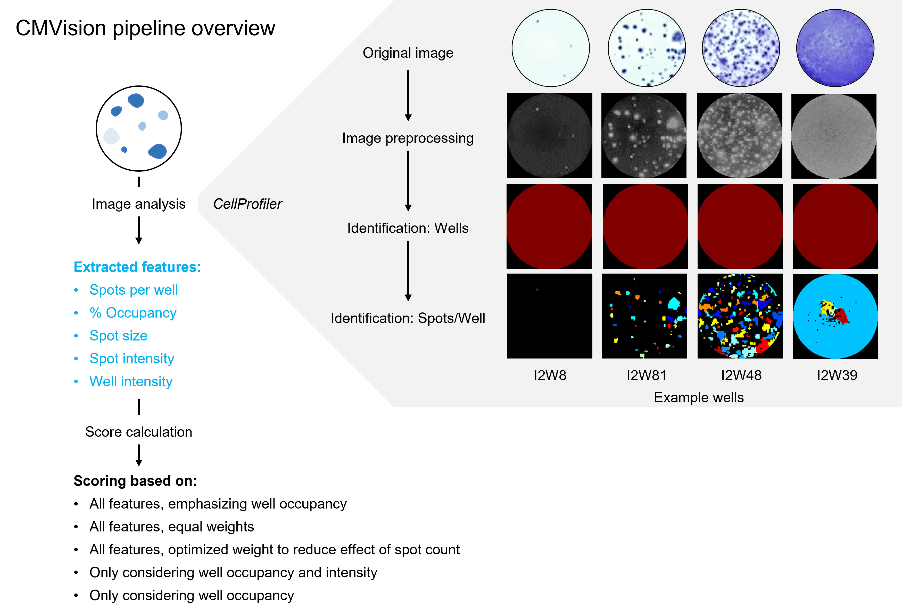

<p align="center">

</p>

# CMVision
CMVision is an open-source multi-feature scoring pipeline for ELISpot image analysis, designed to capture the full complexity of antigen-specific T cell responses. It integrates CellProfiler-based image processing with R-based composite scoring, enabling accurate quantification across multiple ELISpot wells.

> 🧪 CMVision was developed to assess cellular immunity in cancer patients and healthy controls following SARS-CoV-2 mRNA vaccination, but it can be adapted for any ELISpot dataset.

---

## 📌 Overview



**Figure:** Overview of the CMVision pipeline for ELISpot image analysis and composite scoring.  
(A) ELISpot plate images are processed using CellProfiler to extract biologically meaningful features from each well—such as spot count, well occupancy, and intensity metrics. These are used to compute five scoring systems that better reflect immune activity than simple spot enumeration.  
(B) Sample images show accurate segmentation of wells and spots used in the pipeline.

---

## 🧬 Prerequisites

- [CellProfiler](https://cellprofiler.org/) (tested with v4.2.4 or later)
- R (≥ 4.2.0)
- R packages: `tidyverse`, `ggplot2`, `pheatmap`, `reshape2`, `readr`, `data.table`, `dplyr`, `scales`

---

## 🔬 Image Processing with CellProfiler

All raw ELISpot plate images are processed using a custom CellProfiler pipeline provided in the repository. The pipeline performs:

- Conversion of color images to grayscale
- Cropping of individual wells from each plate image
- Intensity rescaling (0 to 1)
- Identification of wells via Otsu three-class thresholding
- Identification of ELISpot "spots" using Otsu two-class thresholding
- Measurement of shape and intensity features per spot and per well
- Export of structured `.tsv` tables with all measured features

> The CellProfiler pipeline file can be found under `/cellprofiler/CMVision_pipeline.cppipe`.

---

## 📊 Feature-Based Scoring and R Scripts

The R portion of the pipeline consists of four key scripts:

### ▶️ `step1_processData.R`
- Reads CellProfiler output
- Selects six key features:
  - `Count_SpotInWell`
  - `AreaOccupied_AreaOccupied_SpotInWell`
  - `Mean_SpotInWell_Intensity_MeanIntensity_Grey`
  - `Mean_SpotInWell_AreaShape_Area`
  - `Mean_Well_Intensity_IntegratedIntensity_Grey`
  - `AreaOccupied_AreaOccupied_Well`
- Computes five scoring schemes using combinations of these features
- Handles missing values and normalization

### ▶️ `step2_makecorrelationheatmaps.R`
- Creates heatmaps showing correlation between features and scoring systems
- Ranks wells based on different scoring strategies

### ▶️ `step3_prepareCMVspikescores.R`
- Aggregates technical replicates
- Calculates background-subtracted scores
- Merges Spike1 and Spike2 peptide pool responses
- Outputs per-subject, per-antigen score tables

### ▶️ `step4_makeboxplots.R`
- Generates group comparisons, boxplots, and correlation scatter plots
- Runs Wilcoxon and Spearman statistics
- Produces figures ready for publication

---

## 🧪 Example Dataset

To facilitate onboarding, we provide:

- A sample ELISpot well image
- CellProfiler output tables
- Metadata and a working `.tsv` file
- Precomputed R outputs

These are located in the `/example_data/` folder and can be used as templates for your own experiments.

---

## 📁 Repository Structure

```
/cellprofiler/
  └── step1_WellsFromPlates.cpproj             # Image processing pipeline : Plate to wells
  └── step2_QuantifyWellsSpots.cpproj          # Image processing pipeline : Wells to measurements per spot per well

/scripts/
  ├── step1_processData.R               # Feature extraction & scoring
  ├── step2_makecorrelationheatmaps.R   # Correlation plots
  ├── step3_prepareCMVspikescores.R     # Per-patient score assembly
  └── step4_makeboxplots.R              # Group comparisons & plots

/example_data/
  ├── sample_ELISpot_image.tif
  ├── sample_cellprofiler_output.csv
  └── sample_metadata.csv
```

---

## 📄 Citation

If you use **CMVision** in your research, please cite:

> Impact of CMV Infection and Cancer Treatment on Vaccine Efficacy in Oncology Patients. Darshak K. Bhatt, Manas Joshi, Frederique Visscher, Annemarie Boerma, Sjoukje F Oosting, Astrid A M van der Veldt, T Jeroen N Hiltermann, Corine H Geurts van Kessel, Anne-Marie C Dingemans, Egbert F Smit, John B A G Haanen, Elisabeth G E de Vries, Debbie van Baarle. medRxiv 2025.08.21.25334174; doi: [https://doi.org/10.1101/2025.08.21.25334174](https://www.medrxiv.org/content/10.1101/2025.08.21.25334174v1)
---

## ❓ Questions?

Please feel free to open an issue or contact us directly for support or feedback.
